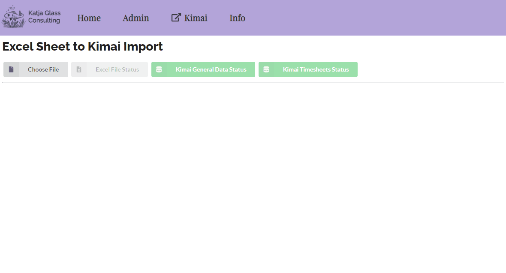

# TimeKex - TimeTracking, Kimai meets Excel

This WebApplication is designed to allow the tracking of working hours in Excel which can then be uploaded to the Kimai Timetracking application.



[Kimai](https://www.kimai.org/) is an open-source free time-tracking application which comes with a lot of functionality and capabilities. There might be situations where the times should be tracked in Excel and finally be uploaded to Kimai. TimeKex is designed to support this process.

The documentation of TimeKex as well as a running demonstration instance is accessible [here](https://katjaglassconsulting.github.io/TimeKex/).

## Status

TimeKex is available in the current version which does not contain tests. The source code is available under the MIT license which allows a flexible and generic usage and modifications without warrenty.

The demonstration is running on the stable Kimai demo instance. Be aware that this demo instances is regularily rebuild.

**Tested with** TimeKex was tested with Kimai version > 1.20. TimeKex is in the update process of supporting 2.8, but currently has some issues with the API.

## Prerequisites

TimeKex will set all time entries submitted from Excel to Kimai as "billable". For this to work, you need to set the permission for users to edit billable on their own timesheets. You find this setting in Kimai "System" -> "Roles" -> "edit_billable_own_timesheet". Set this to "yes" for users.

When you want to create customers, projects and activities, please make sure that in the Excel file all projects are marked as "visible = yes", otherwise there will be issues with creating these.

## Version 1.0.18

The current released version of TimeKex is 1.0.18 and is running under Kimai2 Version 1 and Version 2. TimeKex does contain many undocumented features which can be controlled via the config.js file. You could activate different features when you change from "false" to "true". The following options are available:

  - approval - in case the ApprovalBundle is used, additional related functionality will be available
  - overtime - in case the ApprovalBundle is used and working with overtime, additional related functionality will be available
  - summary15mins - a new tab is visible which indicates time-frames which are no 15 minute blocks
  - breakChecks - an option to check for German Break Rules

Remark: The Kimai ApprovalBundle Plugin is currenty (summer 2023) not supporting Kimai2 Version 2. An update is expected in Q3/Q4 2023.

## CORS

It is meant to run TimeKex on the same server as Kimai, then you will not have issues with CORS. You could for example put the build folder in a folder "timeKex" under your kimai public folder. If you run it on different servers, make sure to enable CORS from what ever URL you have.

To be able to run the demonstration which is accessing a different server, you need to start a browswer without security settings. If you are using Chrome with the default paths, you might be able to start a chrome with disabled security this way:

```
"C:\Program Files\Google\Chrome\Application\chrome.exe" --user-data-dir="C:/temp/chrome_session" --disable-web-security
```

## Installation

### Copy & Paste

The build and deployed homepage is available via GitHub pages in the `gh-pages` branch. The TimeKex application is there available in the `app` folder ([https://github.com/KatjaGlassConsulting/TimeKex/tree/gh-pages/app](https://github.com/KatjaGlassConsulting/TimeKex/tree/gh-pages/app)). You can download and copy all files from the app for example into kimai/public/timekex. Then you can start TimeKex on this web server using your kimai URL, but inlcude kimekex/index.html in the URL, for example: https://example.kimai.de/timekex/index.html. You must update the configuration to fit your needs. It is very important to update the kimaiAPI. If you host kimai under https://example.kimai.de, then the api would be located at  https://example.kimai.de/api/.

```JS
var config = {
    "kimaiAPI" : "https://demo-stable.kimai.org/api/",
    "ignoreActivities" : ["Vacation","Public Holiday"],
    "adminUser" : ["anna_admin","susan_super"],
    "approval" : false,
    "overtime" : false,
    "summary15mins" : false,
    "breakChecks" : false
}
```

### Local Development and Compilation

TimeKex is a ReactJS Web Application. To run a local development version, you can use NPM to install all dependencies and start or build the app. You need to update the configuration to work with the correct kimai API and you might need to work with a broswer with disabled security to avoid CORS if your kimai server is not setup to enable your host.

1. Make sure to have [NPM installed](https://docs.npmjs.com/downloading-and-installing-node-js-and-npm)
2. Download/clone this repository to a folder `<folder>`
3. Open the command line, go to that folder (cd `<folder>`)
4. Install packages using `npm install`
5. Start the development server with `npm start`
6. Build the app via `npm run build`

## License

### Code & Scripts

This project is using the [MIT](http://www.opensource.org/licenses/MIT "The MIT License | Open Source Initiative") license (see [`LICENSE`](LICENSE)) for code and scripts.

### Content

The content files like documentation are released under [CC-BY-4.0](https://creativecommons.org/licenses/by/4.0/). This does not include trademark permissions.

## Contribution

Contributions are very welcome. Be aware that your contribution is under the above licenses. If you would like to contribute for tests, I would recommend Cypress which is my personal preference. 

## Re-use

When you re-use the source, keep or copy the license information also in the source code files. When you re-use the source in proprietary software or distribute binaries (derived or underived), copy additionally the license text to a third-party-licenses file or similar.

When you want to re-use and refer to the content, please do so like the following:

> Content based on [TimeKex Project (GitHub)](https://github.com/KatjaGlassConsulting/TimeKex) used under the [CC-BY-4.0](https://creativecommons.org/licenses/by/4.0/) license.


