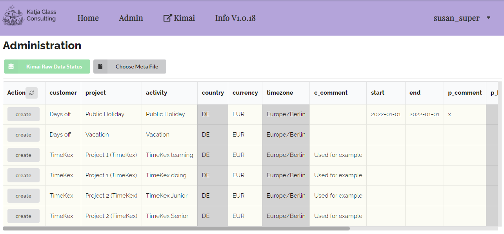
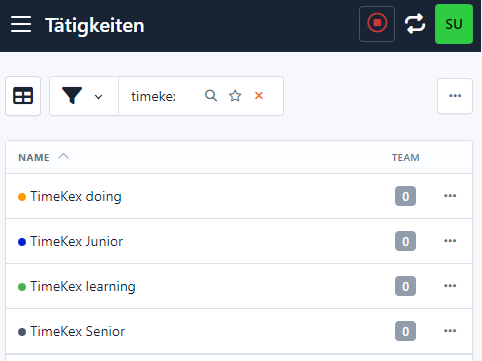

# Admin Panel

Via the Admin Panel it is possible to create Customer, Projects and Activities via an Excel file. If you need to import Customer and Projects together with a lot of other fields, I recommend to use the Kimai command line functionality as in the [documentation](https://www.kimai.org/documentation/imports.html){target=_blank}. For a quick creation, e.g. for test data, this API based approach can be used.

## Excel File

Customer, Projects and Activities can automatically be created through an Excel file. An example file is available under "./exampleFiles/TimeKex_createData.xlsx". The very first line defines the column types (text, numerics, dates) and is recommended to be kept as otherwise sometimes not all information from Excel are imported correctly. The column visible **MUST BE** yes, otherwise the follow up creation from projects to activities might create a new project.


## Load Excel File

The next step is to read in the Excel file with the button `Choose Meta File`. This option is available in the "Admin". Depending on the configuration, this panel might not be visible for the currently logged in user. Make sure you define your admin user names in the configuration.

When the "adminUser" configration is set, then only these users mentioned there will have the "Admin" panel available. If the config does not contain any user, the Admin panel is visible for all.

```
    "adminUser" : ["anna_admin","susan_super"]
```

By clicking `Choose Meta File` the excel file with the specific structure can be selected to be read in. The customer "DELETE" will not be read in, but should be available in the Excel file.


The content is now displayed in a table format:



To actually create the customers / projects / activities, either the "load all" button next to "Action" in the column header can be clicked to create all items, or the single "create" buttons can be clicked to create the corresponding items in Kimai one by one.

This approach can also be used to change settings. The grey boxes contain information which is not read into the application and for this are "unknown" of whether things has been changed or not.

## Kimai Creation Status

By performing the update either by clicking the "Action" button or the single "create"/"change" buttons, the status of the changes are displayed in the table. "ok" meand that it had been created in Kimai. There could also be errors, for example if a user without permission tried to create a project.


## Check in Kimai

You can log into Kimai to see that these projects, customers and activities has been created.

