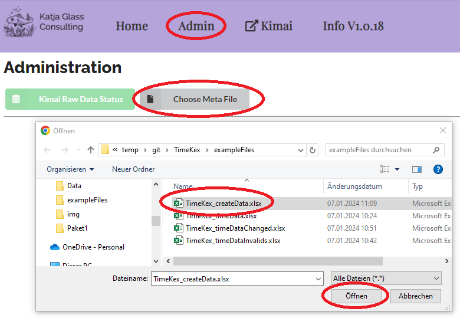

# Admin Panel

Via the Admin Panel it is possible to create Customer, Projects and Activities via an Excel file. If you need to import Customer and Projects together with a lot of other fields, I recommend to use the Kimai command line functionality as in the [documentation](https://www.kimai.org/documentation/imports.html){target=_blank}. For a quick creation, e.g. for test data, this API based approach can be used.

## Excel File

Customer, Projects and Activities can automatically be created through an Excel file. An example file is available under "./exampleFiles/TimeKex_createData.xlsx"


## Create DB Data

To actually create the Customer, Projects and Activities, the "Admin" panel can be used. Depending on the configuration, this panel might not be visible for the currently logged in user.

When the "adminUser" configration is set, then only these users mentioned there will have the "Admin" panel available. If the config does not contain any user, the Admin panel is visible for all.

```
    "adminUser" : ["anna_admin","susan_super"]
```

By clicking "Create DB Data" the excel file with the specific structure can be selected to create the corresponding entries.



## DB Data creation successful

After loading the Excel file, the Customers, Projects and Activities are created via the Kimai API. The success messages can be reviewed on the screen.


**Issues:** When something should be created which already exists, it is not created. Other issues could be available, e.g. the user does not have admin access. This will be printed. Also when a project cannot be created, for example as no customer had been provided, an issue message will appear.

## Check back in Kimai

You can log into Kimai to see that these projects, customers and activities has been created.

