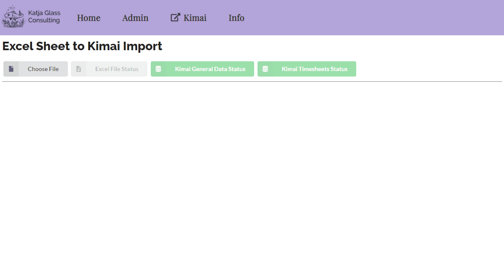

---
hide:
  - navigation
  - toc
---

# Welcome to the TimeKex

TimeKex - Timetracking, Kimai meets Excel

This WebApplication is designed to allow the tracking of working hours in Excel which can then be uploaded to the Kimai Timetracking application.

<a href="https://www.kimai.org/" target="_blank">Kimai</a> is an open-source free time-tracking application which comes with a lot of functionality and capabilities. There might be situations where the times should be tracked in Excel and finally be uploaded to Kimai. TimeKex is designed to support this process.

## Status

TimeKex is available in the current version which does not contain tests. The source code is available under the MIT license which allows a flexible and generic usage and modifications without warrenty.

The demonstration is running on the stable Kimai demo instance. Be aware that this demo instances is regularily rebuild.

