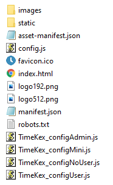

# Setup

## Prerequisites

To be able to run TimeKex, a running instance of Kimai is required together with a user and an API key of this user. The API password can be set in Kimai via "profile", "API" and then "API Password".

There is a stable demonstration version available for Kimai which can be used for demonstration purposes (<a href="https://demo-stable.kimai.org/de/login" target="_blank">linked here</a>). To checkout demo users and specifically the API password of a demo user, check the <a href="https://www.kimai.org/demo/" target="_blank">demo information page</a>.

## Local Development and Compilation

TimeKex is a ReactJS Web Application. To run a local development version, you can use NPM to install all dependencies and start or build the app. 

1. Make sure to have [NPM installed](https://docs.npmjs.com/downloading-and-installing-node-js-and-npm)
2. Download/clone this repository to a folder `<folder>`
3. Open the command line, go to that folder (cd `<folder>`)
4. Install packages using `npm install`
5. Start the development server with `npm start`
6. Build the app via `npm run build`

## Deployment

The TimeKex web application is a simple static HTML fileset which can run locally or on any Webserver. When you have build the app, it can simply be started by opening "index.html".

The final build folder contains next to the config.js also additional example configurations files which you might want to try. Just copy the content as config.js to apply the corresponding configuration. The current configuration files are using the Kimai demonstration server and users.



## Configuration

There are some configurations possible which are set through a `config.json` file in the root folder of the application. Possible settings are explained here.

```json
var config = {
    "kimaiAPI" : "https://XXX/api/",
    "ignoreActivities" : ["Vacation","Public Holiday"],
    "adminUser" : ["anna_admin","susan_super"],    
    "username" : "john_user",
    "password" : "XXX"
}
```

Key | Required | Description
-- | -- | --
kimaiAPI | Yes | URL to the Kimai API - example above is from the demo instance from kimai.org
ignoreActivities | No | Activities which should be ignored (not copied to Kimai, not deleted when available) can be included as Array-List
adminUser | No | The `admin` tab of the app is only displayed when the logged in user is in this list. When this item is not available, the corresponding tab is visible for everyone.
username and password | No | When this is provided through the config, then there is no `Login` screen. This is only recommended for development purposes or when this application is run just locally by one person.

## Excel Structure Timesheets


The Excel file is expected in a specific format. When the Excel file should contain a different structure, for example different column names, this can be changed by a source code updated and re-compiling the app. The file `src/features/excelImport/ExcelSchema` is responsible to read in and map the corresponding Excel file to the specific object required for the application. Feel free to update the column names from the Excel file.

The package [read-excel-file](https://gitlab.com/catamphetamine/read-excel-file) is used to read in the Excel file and use the corresponding schema for mapping. Please look into the package details to apply a different schema.

For the Excel file it is very important that the first sheet contains the time data and that the first row starts with the column names. There can be additional sheets and additional columns in the Excel file. The column order is also not relevant. Example file is available under "./exampleFiles"