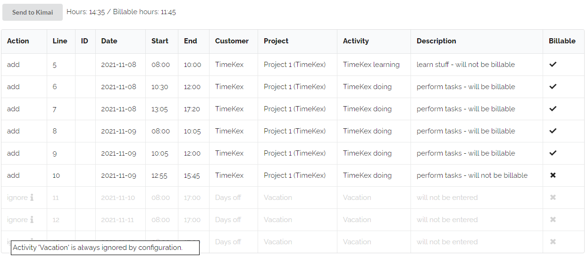

# User Panel

## Login

Typically there will be a login required. This login needs the user name and API passwort. Please make sure to use the API password for Kimai and not the login password.

The login can also be done automatically through the configuration. This can be used for testing purposes, when just one user should use the web application or when the application should be located for each user locally.

```
var config = {
    "username" : "anna_admin",
    "password" : "<PASSWORD>",
    "kimaiAPI" : "https://demo-stable.kimai.org/api/",
    ...
}
```

If there is no automatic login, the login screen is displayed:


If invalid credentials are used, a modal is displayed to show this.

## Process Flow

The web application is designed to load times from Excel to Kimai. With the "Choose File" box, the timesheet Excel file can be selected. Data from the excel and from Kimai is loaded and compared. The main screen displays always week data starting with the last one from Excel and containing only those in the Excel file.

The weeks can be changed easily with a forth and back button. After checking the content the "Send" button sends the update to Kimai. Additional time entries are added and if entries are available in Kimai which are not in the Excel file, these entries are deleted. Before deletion in Kimai is done, there is an extra confirmation screen to make sure not to delete entries which should not have been deleted.

The following animation shows an example flow. Please see below for additional details.


## Main Bar

The main bar contains a button to load the timesheet data excel file and three status boxes. The first status box show the Excel File Status. In case of any issues, this box will be red. When the file is loaded successfully, it will be green.

The "Kimai General Data Status" shows the status of the access to Kimai and when read in the general information, e.g. about customers, projects and activities. When there is an issue, the box will be red, this means the Kimai API is not set correctly or the server is currently not reachable. In case of issues, you might want to check the development console which shows the exact error.

After loading general data, the time sheet data for the user is loaded. The status of this loading is shown through the "Kimai Timesheet Status".


## Excel File

The Excel file should contain at least the following columns which must be on the first sheet and starting in the first row (order of columns irrelevant): Line number, Date, Client, Project, Activity, chargeable, chargeable (correction), Tasks, Start, End

The chargeable (correction) is optional and can also be omitted.

An example could look like the following:


## Per Week Display

When the Excel file is loaded, the per-week display is shown. The week can easily be changed via the week-selection-box. Only weeks available in the Excel file are included.


The main information box of the week displey shows a button to send the timesheet data to kimai and a summary of the hours of this week and how much of those hours are billable.



Below is the list of entries which are in the Excel file and in Kimai. The "Line" is coming from the Excel file line number. "ID" is the internal Kimai ID of that timesheet item. If a row has no ID, that means this row is not in Kimai. The action which is also displayed in the very first column for such a case is to "add" this entry.

There could also be entries in Kimai which are not in the Excel file (missing line, but available ID), in such a case the action would be "delete". 

Some entries should be ignored, for example there could be "vacations" which should not be included in Kimai or which should not be deleted from Kimai as this might be included differenty. Such "ignore" items are maintained in the configuration file of the web application.

```
var config = {
    "ignoreActivities" : ["Vacation","Public Holiday"],
    ...
}
```

Whenever there is something special, there is an "i"nformation icon. With the mouse over effect additional hints are printed.

After clicking the "Send to Kimai" button, the actions are performed. When the action was succcessful, the complete row becomes green and the action text changed from "add" to "added" and from "delete" to "deleted". If issues appeared, the row will be red and issue information can be displayed via the mouseover effect for the "i".

## Invalid Data

The web application is checking some typical errors, that these are available before sending time entries to Kimai. The most common issue is that the Project or Activity does not exist in Kimai. In such cases the lines will be marked as "error" lines which displays an additional error text hint hidden behind the "i". Time overlaps should ideally also not be available and are highlighted. As such issues are not critical, these still can be added.


When clicking the "Send to Kimai" button, only "add" and "delete" actions are executed.


